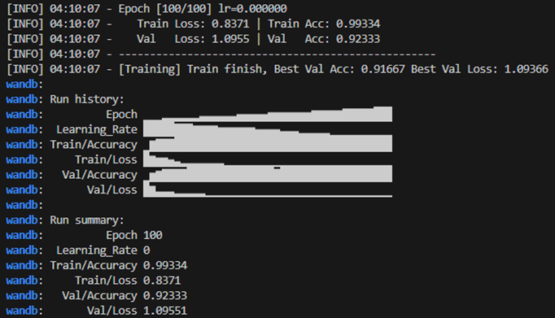
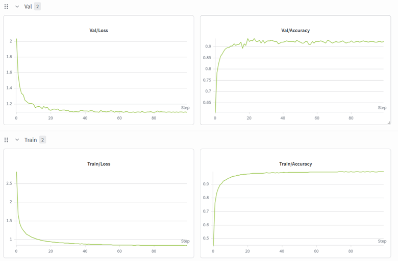

# DLCV_2026_spring
基於深度學習之視覺辨識專論 Selected Topics in Visual Recognition using Deep Learning


## Introduction

HW1
Task: Image classification 100 categories


## Requirements (Environment Setup)

python version: Python 3.12.12


```bash
conda env create -f environment.yml

or

pip install -r requirements.txt
```

## File Structure

```
## 📁 File Structure

```text
hw1/
│
├── data/
│   ├── test/
│   ├── train/
│   └── val/
│
├── logs/
├── model_weight/
├── submission/
├── wandb/
│
├── .gitignore
├── func.py
├── inference.py
├── README.md
└── training.py

```
## How to Run (Usage)

1. train model

    ```bash
    python training.py
    ```

2. inference and generate csv

    modify the train_model_name in main func
    ```bash
    python inference.py
    ```


## Program Description

- `training.py`: model would save in model_weight folder

- `inference.py`: result csv would save in submission folder

- `func.py`: import by `training.py` and `inference.py`, no need to modify


## Performance Snapshot





